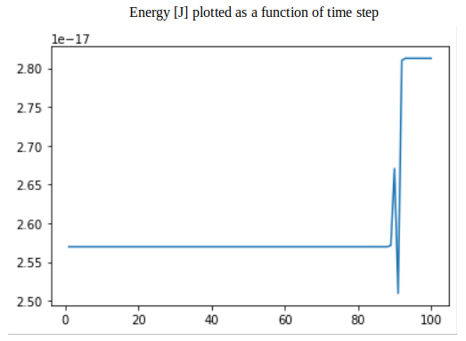
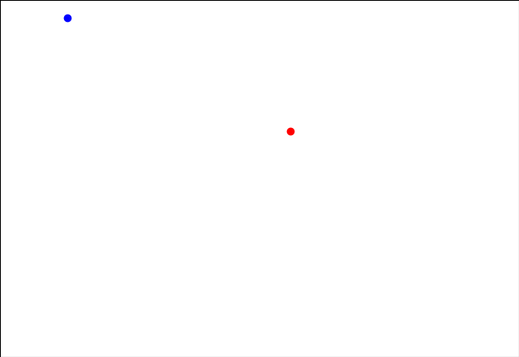
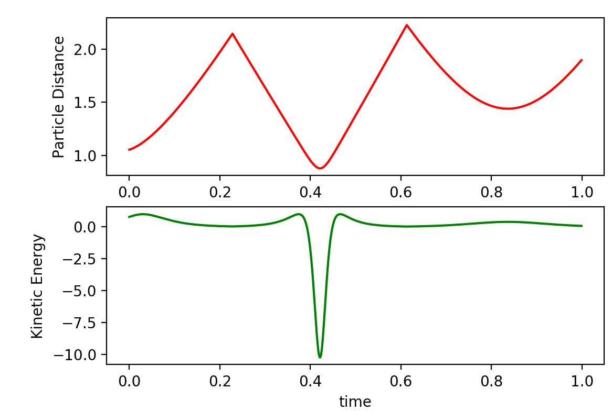
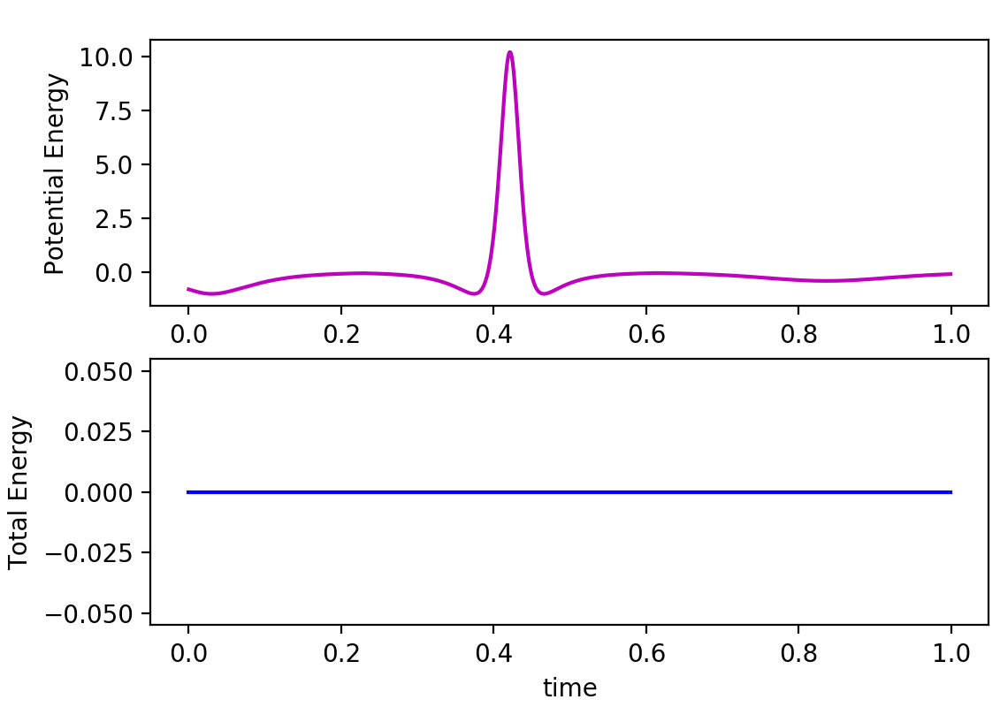

# Weekly progress journal

## Instructions

In this journal you will document your progress of the project, making use of the weekly milestones.

Every week you should 

1. write down **on Wednesday** a short plan (bullet list is sufficient) of how you want to 
   reach the weekly milestones. Think about how to distribute work in the group, 
   what pieces of code functionality need to be implemented. 
2. write about your progress **before** the Tuesday in the next week with respect to the milestones.
   Substantiate your progress with links to code, pictures or test results. Reflect on the
   relation to your original plan.

We will give feedback on your progress on Tuesday before the following lecture. Consult the 
[grading scheme](https://computationalphysics.quantumtinkerer.tudelft.nl/proj1-moldyn-grading/) 
for details how the journal enters your grade.

Note that the file format of the journal is *markdown*. This is a flexible and easy method of 
converting text to HTML. 
Documentation of the syntax of markdown can be found 
[here](https://docs.gitlab.com/ee/user/markdown.html#gfm-extends-standard-markdown). 
You will find how to include [links](https://docs.gitlab.com/ee/user/markdown.html#links) and 
[images](https://docs.gitlab.com/ee/user/markdown.html#images) particularly
useful.

## Week 1
(due before 18 February)
Wednesday 12 February (Group)
TODO List Week 1:
- Decide how to store particle velocity and position at each timestep
- Implement function to calculate Lennard-Jones potential between particles
- Implement function to perform Euler method for time evolution
- Account for periodic boundary conditions
- Implement function to calculate kinetic, potential and total energies of system

Sunday 16 February (Brennan)
- implemented functions for easier access to parameters
- built prototype functions for calculating distance between particles
with periodic boundary conditions
- calculated total potential and kinetic energies of particles
- calculating force between particles in progress

Monday 17 February (Brennan)
- The tracked directory was set up by the bot. Our previous directory was private.
All commits to our (old) journal along with the code in main.py have been moved
to the new repository.
- All milestones have been prototyped but are yet to be tested. Currently, all functions
exist in a single main.py file, but this should be broken up into separate modules.
I will link to working code snippets with respect to each milestone once testing is complete.
- main.py now contains a working prototype script which displays a matplotlib scatter plot of two
Argon molecules moving in a 100x100 Angstrom box with periodic boundary conditions.

End of week report:

The positions and velocities of two particles moving in 2D are tracked in a numpy array. Multiple
sheets for timesteps are stored in memory such that the time-evolution of the particles can be plotted
for investigation after each simulation. Several methods to easily get/set the coordinates and velocities
have been implemented for ease of development.

Since the Lennard-Jones potential is only a function of r (the distance between the particles), we have
precomputed the value of the potential for a range possible distances that the particle may take (noting that this
is no larger than the dimension of the periodic box). By precomputing this 1D vector, we use numpy.gradient to calculate
the derivative with respect to the distance. This derivative can be used to compute both x and y components of the gradient
such that the force between particles can be calculated. The derivative values are stored as a global array and the force
is computed on demand by the function getForce(). This function uses the shortest distance between the two particles to compute
the force between them, and also takes into account their orientation such that the force vector on each particle points
in the proper direction.

The derivative computation:

```
n = 1000 # number of discrete distances with a precomputed gradient
r_vec = np.linspace(sizeOfBox/n,sizeOfBox,n) # 1D array of all possible distances of particles (up to some user-defined precision)

# evaluate the Lennard Jones Potential on the grid
U_lj = 4*epsilon*((sigma/r_vec)**12-(sigma/r_vec)**6)

# evaluate the derivative of the Lennard Jones Potential with respect to r (1D array)
dUdr = np.gradient(U_lj,sizeOfBox/n)
```

The force computation:
```
def getForce(ts):
    # calculates the force on each particle at a given timestep in the x and y directions (returned as a 4-tuple: f1x,f2x,f1y,f2y)
    rel_x = getP1Xcoord(ts)-getP2Xcoord(ts)
    # check for periodic boundary conditions (in x direction), and account for orientation of particles 1 and 2
    if abs(rel_x) > sizeOfBox/2:
        if rel_x < 0:
            rel_x = sizeOfBox-abs(rel_x)
        else:
            rel_x = -sizeOfBox+abs(rel_x)
    # repeat for y direction
    rel_y = getP1Ycoord(ts)-getP2Ycoord(ts)
    if abs(rel_y) > sizeOfBox/2:
        if rel_y < 0:
            rel_y = sizeOfBox-abs(rel_y)
        else:
            rel_y = -sizeOfBox+abs(rel_y)
    r = np.sqrt(rel_x**2+rel_y**2)
    grad = getdUdr(r)
    force_P1_X = -grad*rel_x/r
    force_P2_X = grad*rel_x/r # change of sign from force_P1_X since forces must be equal and opposite
    force_P1_Y = -grad*rel_y/r
    force_P2_Y = grad*rel_y/r
    return force_P1_X,force_P2_X,force_P1_Y,force_P2_Y
```

The Euler method for time evolution was implemented in two separate functions which iterate the coordinates and velocities
of the particles respecitvely. This is trivial once the force at the given timestep has been calculated, since the previous
coordinates and velocities can be used to update the next slot in the array.

The periodic boundary conditions are working well, as evidenced by the particles moving off and
on the plot window as expected. The program runs efficiently, with a timestep of 1e-4 seconds
currently being refreshed at 20fps so that the particle motion is slow enough to investigate. A plot of the x-coordinate
of one particle moving (uninterrupted by the second particle) is shown rastering across the box:


The total energy of the system is also computed, as the sum of both the Lennard-Jones potential between the particles
and the sum of the kinetic energy of the two particles. Energy data is saved by the simulation for investigation afterwards.
The preset particles will collide after a few seconds (the value of sigma was slightly modified
such that this occurs), and the particles will change direction accordingly. One problem is that
direct collisions result in the particle gaining a substantial amount of velocity such that energy
is not conserved, as shown in the plot below. This will require more conversation and investigation to debug.



The particles are currently displayed in a scatter plot like so:



Improvements to be made:
- The prototype code still exists in a main.py file. This is ugly and should be broken up into modules for ease
of maintenance and extensibility. Dedicated classes for certain tasks (such as computing the force) should be made.
- The energy jump during particle collisions is clunky, and could be result of the pre-computed gradient being
too course for a smoother interaction to be seen. We should take a closer look at this before being too committed
to this method.
- A matplotlib scatter plot is effective for basic debugging and displaying of the particles, but should be replaced
by something less hacky. It would be nice to have something which we could easily record simulations for later comparison.

## Week 2
(due before 25 February)
Wednesday 19 February (Group)
Conversion to natural units was already by Isacco. 
Plan for this week is to split the work like this:
- Brennan will work on the simulation in 3D and producing the plots
- Isacco will finish the computation of energies and split functions into more logical modules
- Ludwig will recover (injury) and get up to date with the code as well as debug

We plan to reach all milestones for this week by friday in order for the debugging to happen in the weekend and finalize the journal writing before monday.

End of week report:

As planned, Isacco converted the simulation to natural units and improved our force calculation/extensibility problems from week 1. Brennan improved the matplotlib
simulation to work in 3 dimensions with periodic boundary conditions, and also created plots of position, energies, etc. Ludwig is healthy now, improved commenting
of our code and prototyped new time-evolution functions in advance of week 3. The improvements were prototyped in the "future" branch and a working simulation has
been merged to the master branch. Below, we describe in turn the milestones for the week:

Derive the expression of the kinetic energy in dimensionless units, and implement them:

Isacco derived the natural units and implemented them into the simulation. The calculation for the total energy becomes substantially simpler. The energies
are calculated on-the-fly as the force between molecules is calculated at each timestep. This is done as follows:

```
def getForce(ts):
    # calculates the force on each particle and
    # U of the system  at a given timestep
    # returns n x d numpy array of floats "forceMatrix" to store fx,fy,fz
    # for each particle
    forceMatrix = np.zeros((numOfParticles,numOfDimensions), dtype=float)

    for i in range(numOfParticles):
        j = 0
        while j < i:
            r,rel_x,rel_y,rel_z = getParticleDistance(i,j,ts)
            invr6 = (1/r)**6 #precomputes (1/r)**6
            grad = 24/r * (-2*invr6**2  + invr6)
            # Compute forces
            forceMatrix[i][0] = forceMatrix[i][0] - grad*rel_x/r
            forceMatrix[i][1] = forceMatrix[i][1] - grad*rel_y/r
            forceMatrix[i][2] = forceMatrix[i][2] - grad*rel_z/r
            forceMatrix[j][0] = forceMatrix[j][0] + grad*rel_x/r
            forceMatrix[j][1] = forceMatrix[j][1] + grad*rel_y/r
            forceMatrix[j][2] = forceMatrix[j][2] + grad*rel_z/r
            # Compute U
            U[ts] = 4*(invr6**2 - invr6)

            j += 1
    return forceMatrix
```

The gradient of the Lennard-Jones potential is now computed analytically, and a "force matrix" is used to complete the force calculation
between particles for an arbitrary number of particles. However, the function is currently hardcoded for 3 dimensions, so this may
be improved in the future. We take advantage of the fact that the forces on two interacting particles in the same direction must be
equal and opposite. The potential energy (in natural units) is updated. The total energy may be calculated as:

```
def getTotalEnergy(ts):
    # calculates sum of potential energy and kinetic energy at the timestep
    # of particles in a unit cell
    # Natural units
    T = 0
    for i in range(numOfParticles):
        T = T + getPXvel(i,ts)**2 + getPYvel(i,ts)**2 + getPZvel(i,ts)**2
    E[ts] = U[ts] + T/2
```

The kinetic energy may simply be calculated as (Total Energy) - (Potential Energy).

Implement the minimal image convention:

Isacco implemented the minimal image convention in the getParticleDistance() function:

```
def getParticleDistance(p1,p2,ts):
    # function that returns distance between p1 and p2
    # at the given timestep "ts"
    # (returned as a 4-tuple: r,x1-2,y1-2,z1-2)
    # includes periodic boundary conditions
    x_dist = getPXcoord(p1,ts) - getPXcoord(p2,ts)
    y_dist = getPYcoord(p1,ts) - getPYcoord(p2,ts)
    z_dist = getPZcoord(p1,ts) - getPZcoord(p2,ts)
    x_dist = (x_dist + L/2)%L - L/2
    y_dist = (y_dist + L/2)%L - L/2
    z_dist = (z_dist + L/2)%L - L/2

    r = np.sqrt(x_dist**2 + y_dist**2 + z_dist**2)
    return r,x_dist,y_dist,z_dist
```

The distance is calculated as a relative 3-tuple to particle 1's location. The formulas
for x, y, and z distance take into account the periodic boundary conditions in a way that
does not require any conditioning.

Simulate 2 atoms in 3D space:

Brennan updated the matplotlib plotting to include 3D coordinates. Currently, this is done
by creating a matplotlib scatter plot. The positions and velocities are iterated according
to the Euler method, and the scatter plot is updated for each timestep:

```
iterateCoordinates(i)
iterateVelocities(i)
p1.remove()
p2.remove()
p1 = ax.scatter(getPXcoord(0,i),getPYcoord(0,i), getPZcoord(0,i),color='r')
p2 = ax.scatter(getPXcoord(1,i),getPYcoord(1,i), getPZcoord(0,i),color='b')
plt.pause(0.000005)
```

While looping over all timesteps, the position between particles, potential energy, and
total energy are computed on the fly in pre-allocated vectors. The kinetic energy can be
calculated from the total and potential energies after the simulation. We set one particle
at one corner of the box, and the other in the middle. Through trial and error of modifying
the velocities, we found a configuration where the particles will "collide" once during the
course of the simulation. This is seen from the plot below when the particle distance becomes
on the order of &sigma:



The plot of kinetic energy above shows the velocity dip when the particles are close to each
other and changing direction. Similarly, the potential energy spikes due to the Lennard-Jones
potential at the same timestep. The total energy, for which the starting energy is taken as the
0, remains constant throughout the interaction as one would expect.



In order to maintain energy conservation, we purposefully pick a conservative timestep interval of
0.001 and initial velocities on the order of unity (in our natural units). If these values are
significantly increased, energy is not conserved during particle collisions since the particles
will step too close to each other and be blown apart by the rapidly increasing hard-core repulsion
term.

Future improvements:
- There is still some hardcoding, especially in regards to fixed 3-dimensional simulation, that
should be modified to allow different dimensionalities.
- The code still exists in a single main.py file. This is okay for now given the modest length
of the codebase, but separating functions into modules will be necessary for a clean final product.
- 3D simulations on a matplotlib scatter plot are okay, but appear somewhat arbitrary as the boundaries
of the box are not drawn and the periodic boundary conditions appear as the particles teleporting across
the plot. More time could be invested in developing a more aesthetically pleasing canvas for displaying
the real-time simulations.

## Week 3
(due before 3 March)


## Week 4
(due before 10 March)


## Week 5
(due before 17 March)
