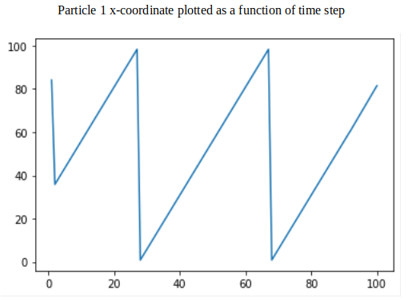
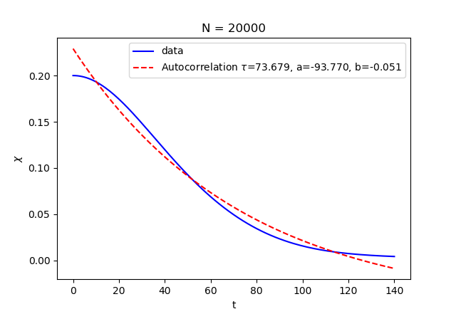

# Weekly progress journal

## Instructions

In this journal you will document your progress of the project, making use of the weekly milestones.

Every week you should

1. write down **on Wednesday** a short plan (bullet list is sufficient) of how you want to
   reach the weekly milestones. Think about how to distribute work in the group,
   what pieces of code functionality need to be implemented.
2. write about your progress **before** the Tuesday in the next week with respect to the milestones.
   Substantiate your progress with links to code, pictures or test results. Reflect on the
   relation to your original plan.

We will give feedback on your progress on Tuesday before the following lecture. Consult the
[grading scheme](https://computationalphysics.quantumtinkerer.tudelft.nl/proj1-moldyn-grading/)
for details how the journal enters your grade.

Note that the file format of the journal is *markdown*. This is a flexible and easy method of
converting text to HTML.
Documentation of the syntax of markdown can be found
[here](https://docs.gitlab.com/ee/user/markdown.html#gfm-extends-standard-markdown).
You will find how to include [links](https://docs.gitlab.com/ee/user/markdown.html#links) and
[images](https://docs.gitlab.com/ee/user/markdown.html#images) particularly
useful.

## Week 1
(due before 18 February)
Wednesday 12 February (Group)
TODO List Week 1:
- Decide how to store particle velocity and position at each timestep
- Implement function to calculate Lennard-Jones potential between particles
- Implement function to perform Euler method for time evolution
- Account for periodic boundary conditions
- Implement function to calculate kinetic, potential and total energies of system

Sunday 16 February (Brennan)
- implemented functions for easier access to parameters
- built prototype functions for calculating distance between particles
with periodic boundary conditions
- calculated total potential and kinetic energies of particles
- calculating force between particles in progress

Monday 17 February (Brennan)
- The tracked directory was set up by the bot. Our previous directory was private.
All commits to our (old) journal along with the code in main.py have been moved
to the new repository.
- All milestones have been prototyped but are yet to be tested. Currently, all functions
exist in a single main.py file, but this should be broken up into separate modules.
I will link to working code snippets with respect to each milestone once testing is complete.
- main.py now contains a working prototype script which displays a matplotlib scatter plot of two
Argon molecules moving in a 100x100 Angstrom box with periodic boundary conditions.

End of week report:

The positions and velocities of two particles moving in 2D are tracked in a numpy array. Multiple
sheets for timesteps are stored in memory such that the time-evolution of the particles can be plotted
for investigation after each simulation. Several methods to easily get/set the coordinates and velocities
have been implemented for ease of development.

Since the Lennard-Jones potential is only a function of r (the distance between the particles), we have
precomputed the value of the potential for a range possible distances that the particle may take (noting that this
is no larger than the dimension of the periodic box). By precomputing this 1D vector, we use numpy.gradient to calculate
the derivative with respect to the distance. This derivative can be used to compute both x and y components of the gradient
such that the force between particles can be calculated. The derivative values are stored as a global array and the force
is computed on demand by the function getForce(). This function uses the shortest distance between the two particles to compute
the force between them, and also takes into account their orientation such that the force vector on each particle points
in the proper direction.

The derivative computation:

```
n = 1000 # number of discrete distances with a precomputed gradient
r_vec = np.linspace(sizeOfBox/n,sizeOfBox,n) # 1D array of all possible distances of particles (up to some user-defined precision)

# evaluate the Lennard Jones Potential on the grid
U_lj = 4*epsilon*((sigma/r_vec)**12-(sigma/r_vec)**6)

# evaluate the derivative of the Lennard Jones Potential with respect to r (1D array)
dUdr = np.gradient(U_lj,sizeOfBox/n)
```

The force computation:
```
def getForce(ts):
    # calculates the force on each particle at a given timestep in the x and y directions (returned as a 4-tuple: f1x,f2x,f1y,f2y)
    rel_x = getP1Xcoord(ts)-getP2Xcoord(ts)
    # check for periodic boundary conditions (in x direction), and account for orientation of particles 1 and 2
    if abs(rel_x) > sizeOfBox/2:
        if rel_x < 0:
            rel_x = sizeOfBox-abs(rel_x)
        else:
            rel_x = -sizeOfBox+abs(rel_x)
    # repeat for y direction
    rel_y = getP1Ycoord(ts)-getP2Ycoord(ts)
    if abs(rel_y) > sizeOfBox/2:
        if rel_y < 0:
            rel_y = sizeOfBox-abs(rel_y)
        else:
            rel_y = -sizeOfBox+abs(rel_y)
    r = np.sqrt(rel_x**2+rel_y**2)
    grad = getdUdr(r)
    force_P1_X = -grad*rel_x/r
    force_P2_X = grad*rel_x/r # change of sign from force_P1_X since forces must be equal and opposite
    force_P1_Y = -grad*rel_y/r
    force_P2_Y = grad*rel_y/r
    return force_P1_X,force_P2_X,force_P1_Y,force_P2_Y
```

The Euler method for time evolution was implemented in two separate functions which iterate the coordinates and velocities
of the particles respecitvely. This is trivial once the force at the given timestep has been calculated, since the previous
coordinates and velocities can be used to update the next slot in the array.

The periodic boundary conditions are working well, as evidenced by the particles moving off and
on the plot window as expected. The program runs efficiently, with a timestep of 1e-4 seconds
currently being refreshed at 20fps so that the particle motion is slow enough to investigate. A plot of the x-coordinate
of one particle moving (uninterrupted by the second particle) is shown rastering across the box:



The total energy of the system is also computed, as the sum of both the Lennard-Jones potential between the particles
and the sum of the kinetic energy of the two particles. Energy data is saved by the simulation for investigation afterwards.
The preset particles will collide after a few seconds (the value of sigma was slightly modified
such that this occurs), and the particles will change direction accordingly. One problem is that
direct collisions result in the particle gaining a substantial amount of velocity such that energy
is not conserved, as shown in the plot below. This will require more conversation and investigation to debug.


The particles are currently displayed in a scatter plot like so:


Improvements to be made:
- The prototype code still exists in a main.py file. This is ugly and should be broken up into modules for ease
of maintenance and extensibility. Dedicated classes for certain tasks (such as computing the force) should be made.
- The energy jump during particle collisions is clunky, and could be result of the pre-computed gradient being
too course for a smoother interaction to be seen. We should take a closer look at this before being too committed
to this method.
- A matplotlib scatter plot is effective for basic debugging and displaying of the particles, but should be replaced
by something less hacky. It would be nice to have something which we could easily record simulations for later comparison.

## Week 2
(due before 25 February)
Wednesday 19 February (Group)
Conversion to natural units was already by Isacco.
Plan for this week is to split the work like this:
- Brennan will work on the simulation in 3D and producing the plots
- Isacco will finish the computation of energies and split functions into more logical modules
- Ludwig will recover (injury) and get up to date with the code as well as debug

We plan to reach all milestones for this week by friday in order for the debugging to happen in the weekend and finalize the journal writing before monday.

End of week report:

As planned, Isacco converted the simulation to natural units and improved our force calculation/extensibility problems from week 1. Brennan improved the matplotlib
simulation to work in 3 dimensions with periodic boundary conditions, and also created plots of position, energies, etc. Ludwig is healthy now, improved commenting
of our code and prototyped new time-evolution functions in advance of week 3. The improvements were prototyped in the "future" branch and a working simulation has
been merged to the master branch. Below, we describe in turn the milestones for the week:

Derive the expression of the kinetic energy in dimensionless units, and implement them:

Isacco derived the natural units and implemented them into the simulation. The calculation for the total energy becomes substantially simpler. The energies
are calculated on-the-fly as the force between molecules is calculated at each timestep. This is done as follows:

```
def getForce(ts):
    # calculates the force on each particle and
    # U of the system  at a given timestep
    # returns n x d numpy array of floats "forceMatrix" to store fx,fy,fz
    # for each particle
    forceMatrix = np.zeros((numOfParticles,numOfDimensions), dtype=float)

    for i in range(numOfParticles):
        j = 0
        while j < i:
            r,rel_x,rel_y,rel_z = getParticleDistance(i,j,ts)
            invr6 = (1/r)**6 #precomputes (1/r)**6
            grad = 24/r * (-2*invr6**2  + invr6)
            # Compute forces
            forceMatrix[i][0] = forceMatrix[i][0] - grad*rel_x/r
            forceMatrix[i][1] = forceMatrix[i][1] - grad*rel_y/r
            forceMatrix[i][2] = forceMatrix[i][2] - grad*rel_z/r
            forceMatrix[j][0] = forceMatrix[j][0] + grad*rel_x/r
            forceMatrix[j][1] = forceMatrix[j][1] + grad*rel_y/r
            forceMatrix[j][2] = forceMatrix[j][2] + grad*rel_z/r
            # Compute U
            U[ts] = 4*(invr6**2 - invr6)

            j += 1
    return forceMatrix
```

The gradient of the Lennard-Jones potential is now computed analytically, and a "force matrix" is used to complete the force calculation
between particles for an arbitrary number of particles. However, the function is currently hardcoded for 3 dimensions, so this may
be improved in the future. We take advantage of the fact that the forces on two interacting particles in the same direction must be
equal and opposite. The potential energy (in natural units) is updated. The total energy may be calculated as:

```
def getTotalEnergy(ts):
    # calculates sum of potential energy and kinetic energy at the timestep
    # of particles in a unit cell
    # Natural units
    T = 0
    for i in range(numOfParticles):
        T = T + getPXvel(i,ts)**2 + getPYvel(i,ts)**2 + getPZvel(i,ts)**2
    E[ts] = U[ts] + T/2
```

The kinetic energy may simply be calculated as (Total Energy) - (Potential Energy).

Implement the minimal image convention:

Isacco implemented the minimal image convention in the getParticleDistance() function:

```
def getParticleDistance(p1,p2,ts):
    # function that returns distance between p1 and p2
    # at the given timestep "ts"
    # (returned as a 4-tuple: r,x1-2,y1-2,z1-2)
    # includes periodic boundary conditions
    x_dist = getPXcoord(p1,ts) - getPXcoord(p2,ts)
    y_dist = getPYcoord(p1,ts) - getPYcoord(p2,ts)
    z_dist = getPZcoord(p1,ts) - getPZcoord(p2,ts)
    x_dist = (x_dist + L/2)%L - L/2
    y_dist = (y_dist + L/2)%L - L/2
    z_dist = (z_dist + L/2)%L - L/2

    r = np.sqrt(x_dist**2 + y_dist**2 + z_dist**2)
    return r,x_dist,y_dist,z_dist
```

The distance is calculated as a relative 3-tuple to particle 1's location. The formulas
for x, y, and z distance take into account the periodic boundary conditions in a way that
does not require any conditioning.

Simulate 2 atoms in 3D space:

Brennan updated the matplotlib plotting to include 3D coordinates. Currently, this is done
by creating a matplotlib scatter plot. The positions and velocities are iterated according
to the Euler method, and the scatter plot is updated for each timestep:

```
iterateCoordinates(i)
iterateVelocities(i)
p1.remove()
p2.remove()
p1 = ax.scatter(getPXcoord(0,i),getPYcoord(0,i), getPZcoord(0,i),color='r')
p2 = ax.scatter(getPXcoord(1,i),getPYcoord(1,i), getPZcoord(0,i),color='b')
plt.pause(0.000005)
```

While looping over all timesteps, the position between particles, potential energy, and
total energy are computed on the fly in pre-allocated vectors. The kinetic energy can be
calculated from the total and potential energies after the simulation. We set one particle
at one corner of the box, and the other in the middle. Through trial and error of modifying
the velocities, we found a configuration where the particles will "collide" once during the
course of the simulation. This is seen from the plot below when the particle distance becomes
on the order of &sigma:


The plot of kinetic energy above shows the velocity dip when the particles are close to each
other and changing direction. Similarly, the potential energy spikes due to the Lennard-Jones
potential at the same timestep. The total energy, for which the starting energy is taken as the
0, remains constant throughout the interaction as one would expect.


In order to maintain energy conservation, we purposefully pick a conservative timestep interval of
0.001 and initial velocities on the order of unity (in our natural units). If these values are
significantly increased, energy is not conserved during particle collisions since the particles
will step too close to each other and be blown apart by the rapidly increasing hard-core repulsion
term.

Future improvements:
- There is still some hardcoding, especially in regards to fixed 3-dimensional simulation, that
should be modified to allow different dimensionalities.
- The code still exists in a single main.py file. This is okay for now given the modest length
of the codebase, but separating functions into modules will be necessary for a clean final product.
- 3D simulations on a matplotlib scatter plot are okay, but appear somewhat arbitrary as the boundaries
of the box are not drawn and the periodic boundary conditions appear as the particles teleporting across
the plot. More time could be invested in developing a more aesthetically pleasing canvas for displaying
the real-time simulations.

## Week 3
(due before 3 March)
Wednesday 26 February (Group)
Plot of Energies already done by Isacco, Ludwig and Brennan.

Plan for this week is to split the work like this:
- add force to parameterMatrix to implement the calculation of the "future" force (Isacco)
- particle initializer and checking generalisation to simulation of many particles (Brennan)
- compare euler and Verlet velocity algorithm with respect to energy conservation for many particles + Journal (Ludwig)
- preparing a structure to implement all functions using different modules (Ludwig)

End of week report:

As planned Isacco implemented the Velocity-Verlet algorithm to in addition to the Euler method.
To calculate the velocities at timestep t the Velocity-Verlet algorithm needs the forces at timestep t and t+dt,
therefore we decided to remove forceMatrix and instead save the forces at each timestep in parameterMatrix.
To make more intuitive the way parameters are stored in parameterMatrix, we changed the name to PC3T.
This choice makes for easier development since the name indicates the indices of the paramters we are trying to store.
```
# Create n x d x 3 numpy array of floats "PC3T" to store n particles
# P = particle, C = coordinate (x, y or z), 3 = (position,velocity, force), T = timestep
# in d dimensions with 3 (position, velocity and force) parameters, and num_t timesteps stored.

# For example, access particle 2's position in the y-direction at time_step=0 as
# PC3T[1][1][0][0]
# Access particle 1's momentum in the x-direction at time_step=1 as
# PC3T[0][0][1][1]

PC3T = np.zeros((numOfParticles,numOfDimensions,3,num_t), dtype=float)
```

The algorithm itself was constructed in order to have minimal code changes from the previous implementation with
Euler algorithm so we followed the same function structure:
```
def iterateCoordinates_Verlet(ts):
    # takes current position, velocity and force at timestep ts and
    # updates particle coordinates for timestep ts+1
    if ts + 1 == num_t:
        next_ts = 0
    else:
        next_ts = ts + 1
    # To avoid redundant computations getForce is only called once per timestep in
    # iterateVelocities_Verlet
    #getForce(ts)
    for i in range(numOfParticles):
        newPXcoord = (getPXcoord(i,ts) + getPXvel(i,ts)*timestep + \
                            0.5*PC3T[i][0][2][ts]*timestep**2)%L
        newPYcoord = (getPYcoord(i,ts) + getPYvel(i,ts)*timestep + \
                            0.5*PC3T[i][1][2][ts]*timestep**2)%L
        newPZcoord = (getPZcoord(i,ts) + getPZvel(i,ts)*timestep + \
                            0.5*PC3T[i][2][2][ts]*timestep**2)%L

        setPXcoord(newPXcoord,i,next_ts)
        setPYcoord(newPYcoord,i,next_ts)
        setPZcoord(newPZcoord,i,next_ts)

def iterateVelocities_Verlet(ts):
    # takes current velocity and force at timestep ts and ts+1
    # and updates particle velicities for timestep ts+1
    # changed if condition to ts+2 due to need to force at ts+1 for updating velocities
    if ts + 1 == num_t:
        next_ts = 0
    else:
        next_ts = ts + 1

    # Position at time ts+1 should already be stored in memory by previous call of
    # iterateCoordinates_Verlet(ts)

    # Get force at time ts+1
    getForce(ts+1)
    for i in range(numOfParticles):
        newPXvel = getPXvel(i,ts) + 0.5*timestep*(PC3T[i][0][2][ts] + PC3T[i][0][2][ts+1])
        newPYvel = getPYvel(i,ts) + 0.5*timestep*(PC3T[i][1][2][ts] + PC3T[i][1][2][ts+1])
        newPZvel = getPZvel(i,ts) + 0.5*timestep*(PC3T[i][2][2][ts] + PC3T[i][2][2][ts+1])

        setPXvel(newPXvel,i,next_ts)
        setPYvel(newPYvel,i,next_ts)
        setPZvel(newPZvel,i,next_ts)
```
As we can see from the code example the forces at timestep ts+1 are assumed to be already computed
from timestep ts. This way we avoid redundant calculations, but, differently from the Euler case, the forces must be initialized before the simulation starts.
```
getForce(0)
```
As this solution is prone to bugs, we intend to implement an initialization routine for initial position and velocities, which will be one of the goals for next week.
This function has been prototyped by Brennan and already works for randomly placing several particles at reasonable positions/velocities in the box. This can be adapted
for particle initialization required in future weeks.

We studied the energy behaviour for the two algorithms. We chose to do this in a simple setup in order to have a clearer understanding of the behaviours of the system: two particles, initially at rest,
are placed close together in the box and their motion oscillates along one axis of the box.
While oscillation is present in the total energy as plotted for both time-evolution algorithms, the plots clearly show an important difference:
Euler's algorithm presents an increasing trend in energy (see first image below) while Velocity-Verlet maintains a constant average energy over time (second image).


There are questions we would still like to answer about the algorithm, especially in regards to the spiking of energy seemed to be caused by a combination of
particle collisions and periodic boundary conditions. When the simulation is visualized in the matplotlib scatter plot,
the particle behaviour looks fine (provided particles do not start too close/too fast such that the jumps in energy cascade).
However, we would like to keep the total energy of the system to be as smooth as possible.

Brennan made the minor fixes required to extend the program to more than 2 particles. Although this had largely been accounted for during the first
prototype, some hardcoded two's were removed and the visual simulation was made to work with multiple particles. The scatter plot can accomodate plenty
of particles in a large box now:


Some other small improvements were made by Brennan and Ludwig which make performing simulations easier:
- We added the ability to more intuitively change timestep/duration of the simulation.
- Plotting is automatically extended to multiple particles
- Plotting can be toggled on/off, and the plotting frequency can now be changed. Since drawing is time-consuming,
this allows us to still view the simulations while they run for fine-grain timesteps without taking a long time.

Several other improvements to the code that we would also like to keep in mind:
- Hardcoding is required to switch between simulation algorithms. This should simply be a user-defined global flag
- Along the same lines, the module is still all sitting in a main.py. A user-facing script should be made to call on
on a "simulation" module which is friendlier to use.
- Currently, the positions/velocities/forces for all timesteps are stored. A very simple fix is implementing
a proper circular-overwrite capability that uses a smaller matrix so that memory isn't wasted. Instead,
properly defined vectors can store quantities we would like to track over the whole simulation, such as
total energy. This should be an easy fix.

## Week 4
(due before 10 March)

Weekly plan:
- We need to investigate the oscillations in our kinetic/total energy, since we are not yet happy with the
results we posted in the last weekly report. Brennan and Isacco are going to look at the force and energy
calculations in order to identify any discrepancies. The tests we were performing today where we start 2 particles
1-1/2 sigma apart with 0 velocity look okay. We want to identify what is going wrong when the particles have more
random motion
- Ludwig and Isacco have begun initializing particles on an fcc lattice. Brennan will sample initial velocities from
a Maxwell-Boltzmann distribution. This task should be finished before Thursday.
- As a group, we will implement the temperature rescaling. We will first try to implement pair correlation and then
other observables, time permitting.

Update on debugging energy conservation (Brennan, 04-03-2020):
A bug was found in the calculation of kinetic energy. When summing the kinetic energy of all particles,
the following erroneous line was being used:
```
KE = 0.5*(KE + getPXvel(i,ts)**2 + getPYvel(i,ts)**2 + getPZvel(i,ts)**2)
```
Obviously, this should be
```
KE = KE + 0.5*(getPXvel(i,ts)**2 + getPYvel(i,ts)**2 + getPZvel(i,ts)**2)
```

Upon making this change, we simulated 2 particles moving along the x-direction in the y=L/2,z=0 plane. They particles'
initial positions were L/2 +/- 0.5 (starting 1 sigma apart), and they had an initial velocity of +/- 0.5. The resulting
plot is shown below


The oscillations, as expected, show 2 particle oscillating longitudinally, bounded by collisions with each other.
The total energy shows small jumps in energy which, in comparison to the magnitudes of kinetic and potential energy,
are effectively negligible.

Using the Euler method for the setup described above, the energy drifts upwards as expected.


With these results, we are happy with our algorithm and are confident to proceed with the week 4 milestones.

Isacco implemented the initialization of the particles on an fcc lattice., writing a function called **init_position**
The program takes as input a user specified lattice constant a (in units of sigma) and a number of particles N. Not every N can be arranged on an fcc lattice therefore the program computes the closest integer that satisfies this constraint sets it as the new N.
In more detail: given n = L/a we have that N = (n + 1)^3 + 3(n+1)n^2 for an fcc lattice.
The program takes a user specified N, then solves the equation above for n and rounds it to an integer. This will determine the final N for the simulation and L will be calculated accordingly, i.e.
L = a*n + a
the additional a avoids putting particles on the boundary.
```
# Find a compatible n
    func = lambda x : numOfParticles - (x + 1)**3 - 3*x**3
    n = int(np.round(fsolve(func, 1.1)))
    # Compute L and exact N
    L = a*n + a # +a to avoid putting particles on boundary
    numOfParticles = (n + 1)**3 + 3*(n+1)*n**2
```
We proceed now to place the particles on the lattice.
To do so we proceed in three steps:
- First we place the particles on a simple cubic lattice
- Second we place the particles on the faces parallel to the xz plane
- Third we place the particles on the faces parallel to the yz plane
- Fourth we place the particles on the faces parallel to the xy plane
Here we can see the implementation in code.
```
# Put particles on cubic lattice
   for i in range(n+1): # loop over z
       for j in range(n+1): # loop over y
           for k in range(n+1): # loop over x
               p = i*(n+1)**2 + j*(n+1) + k #particle index, (n+1)**3 total on the cubic lattice
               setPXcoord(k*a + a/2,p,ts) #a/2 avoids putting particles on boundary
               setPYcoord(j*a + a/2,p,ts)
               setPZcoord(i*a + a/2,p,ts)
   # Put particles on xz faces
   for i in range(n): # loop over z
       for j in range(n+1): # loop over y
           for k in range(n): # loop over x
               p = (n+1)**3 + i*n*(n+1) + j*n + k #particle index, (n+1)*n**2 on x faces
               setPXcoord(k*a + a,p,ts)
               setPYcoord(j*a + a/2,p,ts)
               setPZcoord(i*a + a,p,ts)
   # Put particles on yz faces
   for i in range(n): # loop over z
       for j in range(n): # loop over y
           for k in range(n+1): # loop over x
               p = (n+1)**3 + (n+1)*n**2 + i*n*(n+1) + j*(n+1) + k #particle index, (n+1)*n**2 on yz faces
               setPXcoord(k*a + a/2,p,ts)
               setPYcoord(j*a + a,p,ts)
               setPZcoord(i*a + a,p,ts)
   # Put particles on xy faces
   for i in range(n+1): # loop over z
       for j in range(n): # loop over y
           for k in range(n): # loop over x
               p = (n+1)**3 + 2*(n+1)*n**2 + i*n*n + j*n + k #particle index, (n+1)*n**2 on xy faces
               setPXcoord(k*a + a,p,ts)
               setPYcoord(j*a + a,p,ts)
               setPZcoord(i*a + a/2,p,ts)
```
Here we can see the result for N = 14


Ludwig created a function for the initial velocities called **gaussVel**.
The functions calls for np.random.normal to sample a normal distribution, given the variance (sigma) and mean (mu).
In reduced units we obtained $sigma = sqrt(T/epsilon) = sqrt(T/119.8)$
```
def gaussVel(temp,ts):
    '''
    Function to initialize particles velocity components according to Gaussian distribution.

    Parameters
    -------------------------
    temp = temperature (in Kelvin)
    '''
    global PC3T

    mu, sigma = 0, np.sqrt(temp/119.8) # mean is 0 and standard deviation in Kelvin
    vx = np.random.normal(mu, sigma, numOfParticles)
    vy = np.random.normal(mu, sigma, numOfParticles)
    vz = np.random.normal(mu, sigma, numOfParticles)
    # set mean to zeros
    vx = vx - np.mean(vx)
    vy = vy - np.mean(vy)
    vz = vz - np.mean(vz)
    print(vx)
    # load into PC3T
    for i in range(numOfParticles):
        setPXvel(vx[i],i,ts)
        setPYvel(vy[i],i,ts)
        setPZvel(vz[i],i,ts)
```
We presents the histograms for the velocities distribution, first for the x component only and then for squared modulus.


Brennan implemented the temperature equilibration routine. We rescale the velocities of the system at certain intervals
during the beginning of the simulation to bring the system to the desired temperature. First, we check to see if the temperature
is within 1 degree Kelvin of the desired temperature:

```
if abs(float(T[i]) / (numOfParticles-1) / (3/2) * 119.8 - temp) > 1:
                    # we need to equilibrate
                    # scale all particle velocities
                    scaleParticleVelocities(i)
```

We use natural units for energy, so the factor of 119.8 relates the temperature in Kelvin to this energy scale.

To scale velocities, we multiply all velocity components at the "rescaling" timestep by the desired value
to shift the temperature of the system:

```
def scaleParticleVelocities(ts):
    # uses global variable temp to rescale velocities (all particles, all dimensions)
    # according to the current kinetic energy at the given timestep ts

    # calculate the rescaling
    sum_of_m_vi_squared = 2*float(T[ts])

    rescalingConstant = np.sqrt((numOfParticles-1)*3*temp/119.8/sum_of_m_vi_squared)

    # multiply all velocity components for all particles by this value
    PC3T[:,:,1,ts] = np.multiply(PC3T[:,:,1,ts], rescalingConstant)
```

We played around with the appropriate time scale over which to re-equilibrate. We settled with
40 timesteps of 0.001 in natural units, such that rescaling did not take too long but allowed
sufficient time for the system to adjust to each rescaling. In this way, it did not take too
long to equilibrate the system:


Brennan also implemented the first observable for the system, the pair correlation function.
Once the system has reached equilibrium, the program will start adding the total distance between particles
every time it iterates the system evolution. After running the complete simulation, the average over all
timesteps is taken such that the pair correlation formula can be computed:

```
n, bins, patches = plt.hist(particleDistances, numOfBins, facecolor='g')

    # Calculate pair correlation function for each bin
    pairCorrelation = np.zeros((numOfBins,1),dtype=float)
    for i in range(numOfBins):
        pairCorrelation[i] = 2*L**3/numOfParticles/(numOfParticles-1)*n[i]/4/np.pi/bins[i]**2/(bins[i+1]-bins[i])

    plt.figure(3)
    plt.plot(bins[0:-1],pairCorrelation)
    plt.ylabel('g(r)')
    plt.xlabel(r'$r/\sigma$')
```

The result, when simulated at 90 K, gives the following correlation function:


Currently, the observable is believed to be erroneous as the results does not replicate
the peak-like structure that has been reported in previous literature. (e.g. "Correlations
in the Motion of Atoms in Liquid Argon" by Rahman (1964)). More time will be needed to
debug this.

This is largely because of a bug with the calculation of potential energy which held up
the proper equilibration of the system for several days. This bug was found but left little
time for the thorough implementation of observables. More debugging and code-cleaning will
occur next week.

Ludwig imoplemented the second observable for the system, the pressure. At the end of the simulation, the program will calculate the pressure in the system as described in the provided week 4 notes.

```
    n = MDS_dict['num_t']
    n1 = MDS_dict['equilibrium_timestep']
    B = 119.8/MDS_dict['temp']
    rho = numOfParticles/(L**3)

    S = 0
    for ts in range(n1,n): # plus one to get last index
        for i, j in combinations(range(numOfParticles), 2):
            r,_,_,_ = getParticleDistance(i,j,ts)
            S = S + 24*(-2*(1/r)**11 + (1/r)**5) # S displays the sum over du/dr

    pp = 1 - (B/(6*numOfParticles)*(1/(n-n1)))*S

    P = pp*rho/B

    return P
```

The unit of the pressure has to be overthought.


## Week 5
(due before 17 March)

Weekly plan:
- Brennan will clean the code in order to eliminate global variables and make data more accessible to different functions for calculating observables, extensibility, etc.
- Isacco will implement the calculation of fluctuations and new observables
- Ludwig will start working on the final report and continue working on observables


Progress report:

The Argon simulation is nearing completion, as all milestones for the week have been met up to the extent that some final debugging will need to be done to obtain optimal
results and agreement with the literature.

In anticipation of the end of the project, it was decided that a revamping of the original codebase would be necessary. This included eliminating some previous
global variables used for fast prototyping and refactoring some large functions into smaller functions which could be used to more efficiently calculate
observables. Brennan and Isacco completed this, ensuring that the new code worked up to the standards of the week 4 milestones before proceeding to implement
the observables.

Isacco prototyped the error calculating with a known dataset. The autocorrelated sequence of Gaussian random numbers is created by 
the normal\_autocorr() function in the correlated\_random.py script in the repository. The data looks as follows:


The fit is performed by the autocorr() function:

'''
def autocorr(data, plot=True):
    N_sim = int(data.size) #number of simulation steps
    chi_length = int(round(np.sqrt(N_sim))) #cutoff at sqrt(N_sim)
    chi = np.zeros(shape=(chi_length,))
    for t in range(chi_length):
        a, b, c = 0, 0, 0
        for n in range(N_sim - t):
            a = a + data[n]*data[n+t]
            b = b + data[n]
            c = c + data[n+t]
        chi[t] = a/(N_sim - t) - b*c/(N_sim - t)**2
    # Fit
    xdata = np.arange(chi_length)
    def func(x, tau, a, b):
        return np.exp(-(x-a)/tau) + b
    param, _ = curve_fit(func, xdata, chi)
    tau = param[0]
    if plot == True:
        plt.plot(xdata, chi, 'b-', label='data')
        # Fit
        plt.plot(xdata, func(xdata, *param), 'r--', label=r'fit: $\tau$=%5.3f, a=%5.3f, b=%5.3f' % tuple(param))
        plt.xlabel('t')
        plt.ylabel(r'$\chi$')
        plt.title(r'N = %d' % N_sim)
        plt.legend()
        plt.show()
    return chi, tau
'''

In the case of the data above, the following fit can be obtained:


Isacco and Ludwig also developed the pair correlation function and pressure observables respectively.

The following figures were taking from a simulation run with 14 molecules initialized on an FCC lattice
in 3 dimensions. The set temperature was 136 and the density was given as 0.5 (both in reduced units).





While the machinery for computing observables and their associated errors is there, more
effort will be required before we are in a position to compare a multitude of observables
to literature.

For the report, we are planning on basing our calculated observables off of the 1967 paper
by Verlet illustrating the thermodynamic properties of molecules interacting under a
Lennard-Jones model. We also plan on looking at the correlation function for liquid Argon
as in Rahman's 1964 paper on the subject. As observables are debugged and made to accurately
agree, specific heat, diffusion coefficients, and other observables may be added to the report,
time permitting.